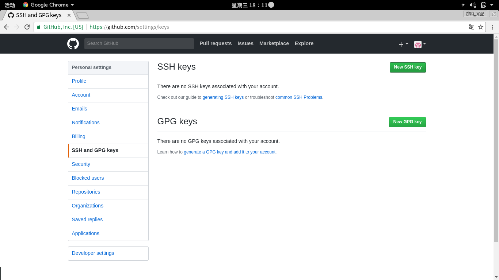
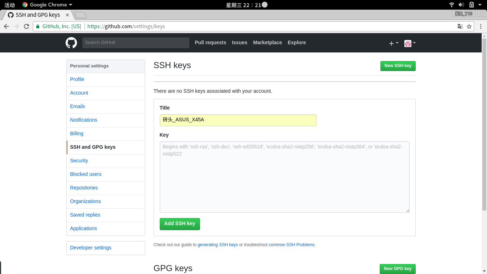
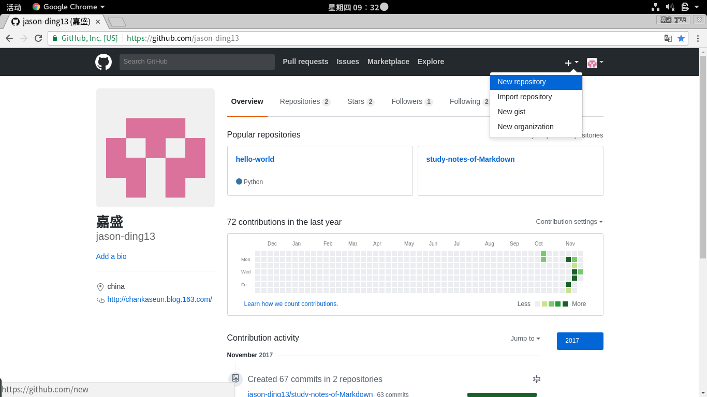
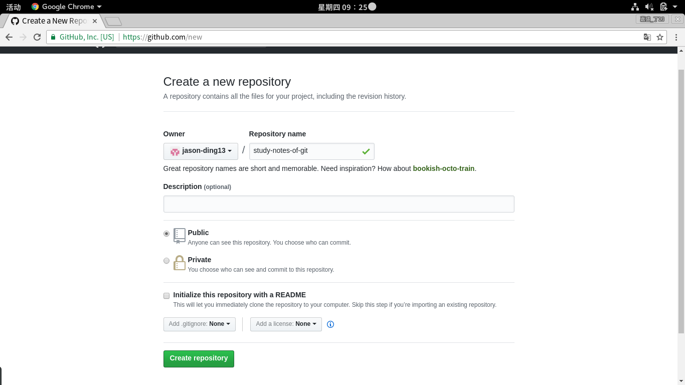
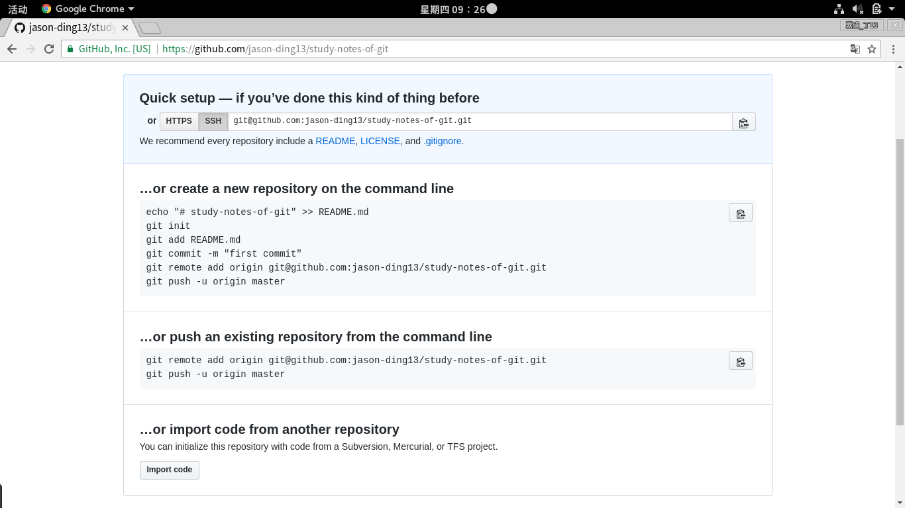
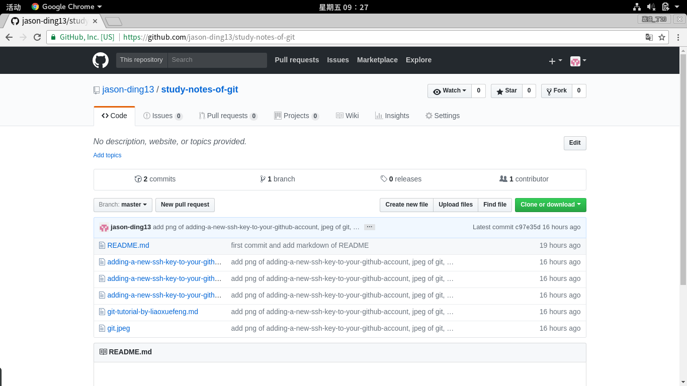
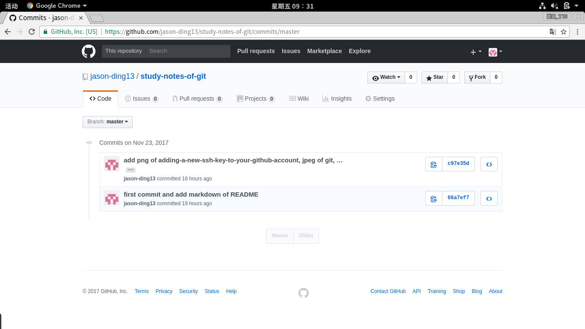
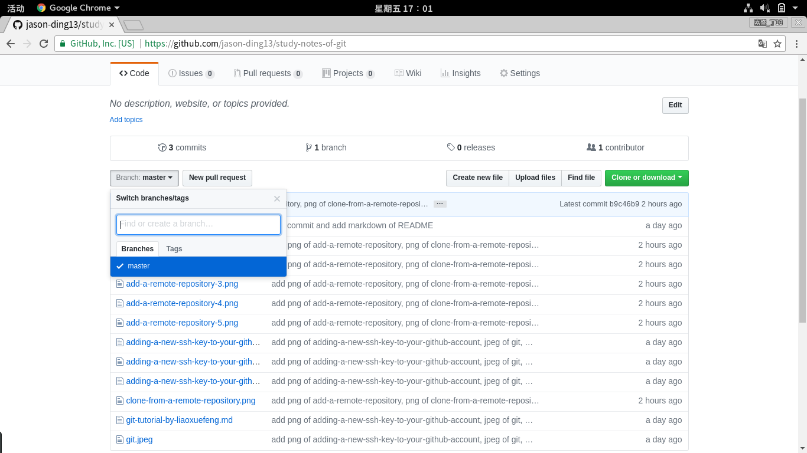

# git tutorial 
 

这是来自廖雪峰的官方网站的git教程的学习笔记。  
据说是史上最浅显易懂的Git教程！

**目录**
1. git简介
2. 版本库
3. 版本控制
4. 远程仓库
5. 分支管理
6. 标签管理
7. 自定义git
8. 总结

## git简介
git是分布式版本控制系统。

### 版本控制系统
什么是版本控制系统？  
针对文件的版本控制，系统将自动记录每次文件的改动，支持多人协作编辑。  
当查看某次改动，只需要在系统里查询即可，如下所示：

| 版本 | 文件名 | 用户 | 说明 |日期 |
| ----- | -------- | ----- | ----- | ----- |
| 1 | service1.doc | 张三 | 删除了软件服务条款5       | 7/12 10:38 |
| 2 | service2.doc | 张三 | 增加了License人数限制  | 7/12 18:09 |
| 3 | service1.doc | 李四 | 财务部门调整了合同金额 | 7/13 09:51 |
| 4 | service2.doc | 张三 | 延长了免费升级周期          | 7/14 15:17 |

### 分布式
什么是分布式？分布式是相对集中式而言的。  
集中式是将版本库存在中央服务器中。多人协同开发时从服务器中提取最新的版本库到本地进行作业，各自将修改提交至服务器。  
分布式是将版本库存放在各个作业的机器中，每个机器的版本库都是最新的。多人协同开发时将修改提交至所有版本库，保持所有版本库都经过同步更新。在实际执行中，通常使用一台中央服务器负责把各自的修改推送至所有的版本库。

## 版本库
什么是版本库？
版本库可以认为是代码仓库，英文名repository。理解为版本的历史仓库，git将记录其中每个文件的修改、删除，为了在任何时候都可以进行版本还原等操作。

### 创建版本库
尝试创建版本库`hello-world`，首先创建一个空目录。
注意，`$LOGNAME`是我的登陆名：jason。
```
$ cd /home/$LOGNAME/Repository
$ mkdir hello-world
$ cd hello-world
$ pwd
/home/jason/Repository/hello-world
```

使用`git init`创建一个空的 git 仓库或重新初始化一个已存在的仓库。
```
$ pwd
/home/jason/Repository/hello-world
$ git init
已初始化空的 Git 仓库于 /home/jason/Repository/hello-world/.git/
```

使用`ls -ah`发现当前目录下新建了`.git`目录，该目录存放git管理版本库的文件。  
在已存在仓库的目录使用`git init`将重新初始化仓库。  
另外，`git init`不要求在空目录执行。
```
$ pwd
/home/jason/Repository/hello-world
$ $ ls -ah
.  ..  .git
$ git init
重新初始化已存在的 Git 仓库于 /home/jason/Repository/hello-world/.git/
```

### 添加文件到版本库
尝试添加文件`txt_1.txt`到刚创建的版本库`hello-world`中。  
添加文件到版本库并不是简单把文件移动到指定目录就可以的。  
首先在目录`hello-world`创建文件`txt_1.txt`，内容如下：
```
txt_1
```

使用`git add <pathspec>`添加文件内容至索引。  
注意添加的文件要求存放在版本库目录下（子目录也可以）。
执行命令没有任何返回，说明添加成功。
> “没有消息就是好消息。”——*Unix的哲学*
```
$ pwd
/home/jason/Repository/hello-world
$ git add txt_1.txt
```

使用`git commit -m <msg>`记录变更到仓库。  
在提交中使用给定的`<msg>`作为提交说明。  
此处的提交说明非常重要，在版本控制中需要提交说明才能准确回滚。  
执行命令返回`1 file changed, 1 insertion(+)`。  
说明修改1个文件，插入1行文本。
```
$ pwd
/home/jason/Repository/hello-world
$ git commit -m 'wrote a txt file txt_1.txt'
[master（根提交） bd9fb3c] wrote a txt file txt_1.txt
 Committer: jason <jason@Jason.PC>
您的姓名和邮件地址基于登录名和主机名进行了自动设置。请检查它们正确
与否。您可以对其进行设置以免再出现本提示信息：

    git config --global --edit

设置完毕后，您可以用下面的命令来修正本次提交所使用的用户身份：

    git commit --amend --reset-author

 1 file changed, 1 insertion(+)
 create mode 100644 txt_1.txt
```

根据提示，使用`git config --global --edit`设置登录名和主机名。  
取消`name = jason`和`email = jason@Jason.PC`两行的注释。
```
 # This is Git's per-user configuration file.
 [user]
 # Please adapt and uncomment the following lines: 
        name = jason
        email = jason@Jason.PC
```

使用`git commit --amend --reset-author -m 'wrote a txt file txt_1.txt and reset anthor'`修正上一次提交。
```
$ pwd
/home/jason/Repository/hello-world
$ git commit --amend --reset-author -m 'wrote a txt file txt_1.txt and reset anthor'
[master d78f63a] wrote a txt file txt_1.txt and reset anthor
 1 file changed, 1 insertion(+)
 create mode 100644 txt_1.txt
```

注意使用`git add <pathspec>`可一次添加多个文件，  
然后使用`git commit -m <msg>`一次提交。  
参考`txt_1.txt`在`hello-world`目录下创建`txt_2.txt`和`txt_3.txt`。
```
$ pwd
/home/jason/Repository/hello-world
$ git add txt_2.txt txt_3.txt
$ git commit -m 'add two files: txt_2.txt, txt_3.txt'
[master 8c7be40] add two files: txt_2.txt, txt_3.txt
 2 files changed, 2 insertions(+)
 create mode 100644 txt_2.txt
 create mode 100644 txt_3.txt
```

## 版本控制
使用git对版本库进行管理，查看版本库状态，版本回退，管理修改，撤销修改，删除修改等。

### 版本库状态
使用`git status` 显示工作区状态。
```
$ pwd
/home/jason/Repository/hello-world
$ git status
位于分支 master
无文件要提交，干净的工作区
```

对目录`hello-world`的`txt_1.txt`进行修改：
```
txt_1 is modified.
```

使用`git status`，显示`txt_1.txt`被修改了。  
但是已修改的`txt_1.txt`未添加到版本库中，同时无法得知具体的修改。
```
$ pwd
/home/jason/Repository/hello-world
$ git status
位于分支 master
尚未暂存以备提交的变更：
  （使用 "git add <文件>..." 更新要提交的内容）
  （使用 "git checkout -- <文件>..." 丢弃工作区的改动）

	修改：     txt_1.txt

修改尚未加入提交（使用 "git add" 和/或 "git commit -a"）
```

使用`git diff`显示版本库中和工作区之间等的差异。  
根据输出，得知`txt_1.txt`当前版本与上一个在版本库中提交版本的具体修改。
```
$ pwd
/home/jason/Repository/hello-world
$ git diff
diff --git a/txt_1.txt b/txt_1.txt
index cc4de1c..d7a0f81 100644
--- a/txt_1.txt
+++ b/txt_1.txt
@@ -1 +1 @@
-txt_1
+txt_1 is modified.
```

使用`git add <pathspec>`把当前版本的`txt_1.txt`添加到版本库。  
使用`git status`，显示`txt_1.txt`被修改了。与上文相比，少了最后一行输出。
> 修改尚未加入提交（使用 "git add" 和/或 "git commit -a"）

使用`git diff`，没有任何输出，得知版本库中与工作区间没有差异。
```
$ pwd
/home/jason/Repository/hello-world
$ git add txt_1.txt 
$ git status
位于分支 master
要提交的变更：
  （使用 "git reset HEAD <文件>..." 以取消暂存）

	修改：     txt_1.txt
$ git diff
```

使用`git commit -m <msg>`提交修改。
使用`git status`显示工作区已没有文件被修改。
使用`git diff`，再次没有任何输出。
```
$ pwd
/home/jason/Repository/hello-world
$ git commit -m 'modify txt_1'
[master 5cf1eba] modify txt_1
 1 file changed, 1 insertion(+), 1 deletion(-)
$ git status
位于分支 master
无文件要提交，干净的工作区
$ git diff
```

### 版本回退
对目录`hello-world`的`txt_1.txt`进行再次修改：
```
txt_1 is modified again.
```

添加已修改的`txt_1.txt`到版本库并提交。
```
$ pwd
/home/jason/Repository/hello-world
$ git add txt_1.txt 
$ git commit -m 'modify txt_1 again'
[master 1659240] modify txt_1 again
 1 file changed, 1 insertion(+), 1 deletion(-)
```

使用`git log`查看版本库在过去进行修改的历史记录。
```
$ pwd
/home/jason/Repository/hello-world
$ git log
commit 165924055d0d5c4760d7fce9b994cd1846cd1cfd (HEAD -> master)
Author: jason <jason@Jason.PC>
Date:   Sat Nov 18 22:12:36 2017 +0800

    modify txt_1 again

commit 5cf1eba7b419c5149c6b094e6e375736b59b66f9
Author: jason <jason@Jason.PC>
Date:   Sat Nov 18 22:02:58 2017 +0800

    modify txt_1

commit 8c7be406876ddbd4a9ec9a0b5a9200ac0ab9002e
Author: jason <jason@Jason.PC>
Date:   Sat Nov 18 19:53:58 2017 +0800

    add two files: txt_2.txt, txt_3.txt

commit d78f63a66f0848a7ed4ede10aa2b82e7e2a1e303
Author: jason <jason@Jason.PC>
Date:   Sat Nov 18 19:40:52 2017 +0800

    wrote a txt file txt_1.txt and reset anthor
(END)
```

可使用`git log --pretty=oneline`仅输出`commit id`和`commit msg`。  
`commit id `是通过SHA1计算得到的十六进制数，可理解为版本库的版本号。  
`commit msg`是关于该提交的说明。  
`HEAD`指当前版本库为该提交记录提交后的版本库，可以理解为指向版本库历史的指针。
```
$ pwd
/home/jason/Repository/hello-world
$ git log
165924055d0d5c4760d7fce9b994cd1846cd1cfd (HEAD -> master) modify txt_1 again
5cf1eba7b419c5149c6b094e6e375736b59b66f9 modify txt_1
8c7be406876ddbd4a9ec9a0b5a9200ac0ab9002e add two files: txt_2.txt, txt_3.txt
d78f63a66f0848a7ed4ede10aa2b82e7e2a1e303 wrote a txt file txt_1.txt and reset anthor
```

使用`git reset [--soft | --mixed [-N] | --hard | --merge | --keep] [<commit>]`进行版本回退。  
**当前`--hard`选项是指回退，同时工作区移动至点。**
`[<commit>]`项可输入历史记录中版本对应的`commit id`。  
`HEAD^`指当前上一个版本的`commit id`。
```
$ pwd
/home/jason/Repository/hello-world
$ git reset --hard HEAD^
HEAD 现在位于 5cf1eba modify txt_1
$ cat txt_1.txt
txt_1 is modified.
```

使用`git log --pretty=oneline`查看回退后的历史记录。  
与回退前相比，少了一个记录，版本实现回退。
> 165924055d0d5c4760d7fce9b994cd1846cd1cfd (HEAD -> master) modify txt_1 again

同时`HEAD`移动到`modify txt_1`的记录上。
```
$ pwd
/home/jason/Repository/hello-world
$ git log --pretty=oneline
5cf1eba7b419c5149c6b094e6e375736b59b66f9 (HEAD -> master) modify txt_1
8c7be406876ddbd4a9ec9a0b5a9200ac0ab9002e add two files: txt_2.txt, txt_3.txt
d78f63a66f0848a7ed4ede10aa2b82e7e2a1e303 wrote a txt file txt_1.txt and reset anthor
```

使用`git reset --hard [<commit>]`，  
其中`[<commit>]`项输入`8c7be40`，  
实现版本回退至`add two files: txt_2.txt, txt_3.txt`。
```
$ pwd
/home/jason/Repository/hello-world
$ git reset --hard 8c7be40
HEAD 现在位于 8c7be40 add two files: txt_2.txt, txt_3.txt
$ git log --pretty=oneline
8c7be406876ddbd4a9ec9a0b5a9200ac0ab9002e (HEAD -> master) add two files: txt_2.txt, txt_3.txt
d78f63a66f0848a7ed4ede10aa2b82e7e2a1e303 wrote a txt file txt_1.txt and reset anthor
```

可见，版本回退同时，`git log`的历史记录同步回退，因此部分记录将丢失。
使用`git reflog`可查所有在版本库上进行的`commit`或`reset`操作。
```
$ pwd
/home/jason/Repository/hello-world
$ git reflog
8c7be40 (HEAD -> master) HEAD@{0}: reset: moving to 8c7be40
5cf1eba HEAD@{1}: reset: moving to HEAD^
1659240 HEAD@{2}: commit: modify txt_1 again
5cf1eba HEAD@{3}: commit: modify txt_1
8c7be40 (HEAD -> master) HEAD@{4}: commit: add two files: txt_2.txt, txt_3.txt
d78f63a HEAD@{5}: commit (amend): wrote a txt file txt_1.txt and reset anthor
bd9fb3c HEAD@{6}: commit (initial): wrote a txt file txt_1.txt
```

根据`git reflog`的记录，把版本回退至`modify txt_1 again`。  
此处使用`git reset --hard HEAD@{2}`替代`git reset --hard 1659240`亦可。
```
$ pwd
/home/jason/Repository/hello-world
$ git reset --hard 1659240
HEAD 现在位于 1659240 modify txt_1 again
$ git reflog
1659240 (HEAD -> master) HEAD@{0}: reset: moving to 1659240
8c7be40 (HEAD -> master) HEAD@{1}: reset: moving to 8c7be40
5cf1eba HEAD@{2}: reset: moving to HEAD^
1659240 HEAD@{3}: commit: modify txt_1 again
5cf1eba HEAD@{4}: commit: modify txt_1
8c7be40 (HEAD -> master) HEAD@{5}: commit: add two files: txt_2.txt, txt_3.txt
d78f63a HEAD@{6}: commit (amend): wrote a txt file txt_1.txt and reset anthor
bd9fb3c HEAD@{7}: commit (initial): wrote a txt file txt_1.txt
```

### 工作区与暂存区
前文提到，版本库是版本的历史仓库。  
版本库的工作区是指版本库所管理的目录。  
这也是每段代码都有`pwd`的原因。  
版本库的暂存区是指在当前版本基础上已进行`git add <file>`所添加的文件的修改，未进行`git commit -m <msg>`提交的版本。  
添加文件到版本库实际是添加文件到版本库的暂存中。

#### 工作区
在`hello-world`目录下修改`txt_2.txt`，创建`txt_4.txt`。  
使用`git status`，  
`txt_2.txt`的对应输出是：
> 尚未暂存以备提交的变更
  
`txt_4.txt`的对应输出是：
> 未跟踪的文件

其中，`txt_2.txt`是版本库当前版本已添加的文件，  
`txt_4.txt`则是版本当前版本未添加的文件。  
由于两个文件都在`hello-world`的目录，即工作区中。  
因此`git status`输出的是工作区上的状态。
```
$ pwd
/home/jason/Repository/hello-world
$ git status
位于分支 master
尚未暂存以备提交的变更：
  （使用 "git add <文件>..." 更新要提交的内容）
  （使用 "git checkout -- <文件>..." 丢弃工作区的改动）

	修改：     txt_2.txt

未跟踪的文件:
  （使用 "git add <文件>..." 以包含要提交的内容）

	txt_4.txt
```

#### 暂存区
根据提示，把`txt_2.txt`和`txt_4.txt`添加到版本库的暂存区。  
使用`git status`，两者输出都是
> **要提交的变更**

而不是
> *尚未暂存以备提交的变更*

与
> *未跟踪的文件*

具体显示了`txt_2.txt`是修改，`txt_4.txt`是新文件。
```
$ pwd
/home/jason/Repository/hello-world
$ git add txt_2.txt txt_4.txt
$ git status
位于分支 master
要提交的变更：
  （使用 "git reset HEAD <文件>..." 以取消暂存）

	修改：     txt_2.txt
	新文件：   txt_4.txt
```

把已添加`txt_2.txt`和`txt_4.txt`的暂存区版本进行提交。  
使用`git status`显示，工作区与版本库当前版本一致，即**干净**的工作区。
```
$ pwd
/home/jason/Repository/hello-world
$ git commit -m 'modify txt_2 and wrote txt_4'
[master 66fe425] modify txt_2 and wrote txt_4
 2 files changed, 2 insertions(+), 1 deletion(-)
 create mode 100644 txt_4.txt
$ git status
位于分支 master
无文件要提交，干净的工作区
```

以内存、硬盘缓存、硬盘近似比喻版本库的工作区、暂存区、当前版本的关系。  
对硬盘的文件进行修改，首先把该文件储存至内存，  
如未修改的工作区实际就是当前版本，即干净的工作区是指文件目录中的状态与版本库当前一致。  
然后把经过修改的文件写入硬盘缓存，如把工作区的修改添加到暂存区。  
最后把硬盘缓存的结果写入硬盘，如把暂存区提交至版本库，创建新版本。
区别在于：实际写入硬盘缓存的修改是不可撤销的，而暂存区的修改是可撤销的。

### 管理修改
git管理的是文件的修改，不是文件本身。  
在`hello-world`目录下修改`txt_3.txt`，如下：
```
txt_3 is modified.
```

添加修改，查看状态。
```
$ pwd
/home/jason/Repository/hello-world
$ git add txt_3.txt
$ git status
位于分支 master
要提交的变更：
  （使用 "git reset HEAD <文件>..." 以取消暂存）

	修改：     txt_3.txt
```

再次修改`txt_3.txt`，如下：
```
txt_3 is modified again.
```

不添加第二次修改进行提交，查看状态可见存在未添加的修改。
```
$ git commit -m 'modify txt_3'
$ git status
位于分支 master
尚未暂存以备提交的变更：
  （使用 "git add <文件>..." 更新要提交的内容）
  （使用 "git checkout -- <文件>..." 丢弃工作区的改动）

	修改：     txt_3.txt

修改尚未加入提交（使用 "git add" 和/或 "git commit -a"）
$ git diff -- txt_3.txt
diff --git a/txt_3.txt b/txt_3.txt
index e3916a1..6451ff9 100644
--- a/txt_3.txt
+++ b/txt_3.txt
@@ -1 +1 @@
-txt_3 is modified.
+txt_3 is modified again.
```

### 撤销修改
使用`git checkout -- <paths>`撤销已在工作区发生，未添加至暂存区的修改。  
与`git add <file>`同样遵循：
> “没有消息就是好消息。”——*Unix的哲学*
```
$ pwd
/home/jason/Repository/hello-world
$ cat txt_3.txt
txt_3 is modified again.
$ git status
位于分支 master
尚未暂存以备提交的变更：
  （使用 "git add <文件>..." 更新要提交的内容）
  （使用 "git checkout -- <文件>..." 丢弃工作区的改动）

	修改：     txt_3.txt

修改尚未加入提交（使用 "git add" 和/或 "git commit -a"）
$ git checkout -- txt_3.txt
$ cat txt_3.txt
txt_3 is modified.
$ git status
位于分支 master
无文件要提交，干净的工作区
```

对`hello-world`目录下`txt_3.txt`再次修改，并把修改添加至版本库。  
使用`git reset HEAD <paths>`将暂存区的指定文件回退至当前版本， 即撤销已添加至暂存区的修改，但不撤销工作区的修改。  
组合使用`git checkout -- <paths>`和`git reset HEAD <paths>`可撤销未提交的修改。
```
$ pwd
/home/jason/Repository/hello-world
$ cat txt_3.txt
txt_3 is modified again.
$ git add txt_3.txt
$ git status
位于分支 master
要提交的变更：
  （使用 "git reset HEAD <文件>..." 以取消暂存）

	修改：     txt_3.txt
$ git reset HEAD txt_3.txt
重置后取消暂存的变更：
M	txt_3.txt
$ git status
位于分支 master
尚未暂存以备提交的变更：
  （使用 "git add <文件>..." 更新要提交的内容）
  （使用 "git checkout -- <文件>..." 丢弃工作区的改动）

	修改：     txt_3.txt

修改尚未加入提交（使用 "git add" 和/或 "git commit -a"）
$ git checkout -- txt_3.txt
$ git status
位于分支 master
无文件要提交，干净的工作区
```
### 删除文件
把删除文件的修改添加至暂存区有如下两种方式：

* 组合使用`rm [file]`与`git rm <file>`
* 直接使用`git rm <file>`

组合使用`rm [file]`与`git rm <file>`实际与修改文件一致。  
`rm [file]`相当于对工作区进行修改。  
`gir rm <file>`相当于把工作区的修改添加至暂存区。
```
$ pwd
/home/jason/Repository/hello-world
$ rm txt_4.txt
$ ls
txt_1.txt  txt_2.txt  txt_3.txt
$ git status
位于分支 master
尚未暂存以备提交的变更：
  （使用 "git add/rm <文件>..." 更新要提交的内容）
  （使用 "git checkout -- <文件>..." 丢弃工作区的改动）

	删除：     txt_4.txt

修改尚未加入提交（使用 "git add" 和/或 "git commit -a"）
$ git rm txt_4.txt
rm 'txt_4.txt'
$ git status
位于分支 master
要提交的变更：
  （使用 "git reset HEAD <文件>..." 以取消暂存）

	删除：     txt_4.txt
$ git commit -m 'delete txt_4.txt'
[master 2daa693] delete txt_4.txt
 1 file changed, 1 deletion(-)
 delete mode 100644 txt_4.txt
```

首先使用`git reset <commit>`与`git checkout -- <paths>`还原`txt_4.txt`。  
然后直接使用`git rm <file>`添加删除至暂存区。  
直接使用`git rm <file>`实际与组合使用`rm <file>`与`git rm <file>`没有区别。  
考虑到工作区、暂存区、当前版本的关系，个人建议采取第一种方式删除文件。
```
$ pwd
/home/jason/Repository/hello-world
$ git reset HEAD^
重置后取消暂存的变更：
D	txt_4.txt
$ git checkout -- txt_4.txt
$ ls
txt_1.txt  txt_2.txt  txt_3.txt  txt_4.txt
$ git rm txt_4.txt 
rm 'txt_4.txt'
$ ls
txt_1.txt  txt_2.txt  txt_3.txt
$ 位于分支 master
要提交的变更：
  （使用 "git reset HEAD <文件>..." 以取消暂存）
$ git commmit -m 'delete txt_4.txt'
[master dda03d5] delete txt_4.txt
 1 file changed, 1 deletion(-)
 delete mode 100644 txt_4.txt
```
## 远程仓库
本地git仓库和远程[github](https://github.com)仓库之间的传输是可以通过SSH加密的。  
首先根据github官方的引导[checking-for-existing-ssh-keys](https://help.github.com/articles/checking-for-existing-ssh-keys)使用`ls -al ~/.ssh`检查是否已存在**SSH key**  。  
如果`.ssh`目录已存在，同时目录下存在类似`id_rsa.pub`和`id_rsa`的文件，表示已存在**SSH key**。  
前者`id_rsa.pub`为公钥，后者`id_rsa`为私钥。  
可见我的砖头是没有**SSH key**的。。。
```
$ ls -al ~./ssh
ls: 无法访问'~./ssh': No such file or directory
```

然后根据github官方的引导[generating-a-new-ssh-key-and-adding-it-to-the-ssh-agent](https://help.github.com/articles/generating-a-new-ssh-key-and-adding-it-to-the-ssh-agent)创建**SSH key**。
使用`ssh-keygen`创建，根据提示直接`<enter>`确定新建的**SSH key**保存目录。  
默认保存目录为`/home/$LOGNAME/.ssh/id_rsa`。
```
$ ssh-keygen -t rsa -b 4096 -C "623409222@qq.com"
Generating public/private rsa key pair.
Enter file in which to save the key (/home/jason/.ssh/id_rsa): 
Created directory '/home/jason/.ssh'.
```

更进一步，可以为新建的**SSH key**添加密码`passphrase`。  
此处我不添加了，毕竟我的砖头也马上要退役了，直接`<enter>`。
```
Enter passphrase (empty for no passphrase): 
Enter same passphrase again: 
Your identification has been saved in /home/jason/.ssh/id_rsa.
Your public key has been saved in /home/jason/.ssh/id_rsa.pub.
The key fingerprint is:
SHA256:***************************************************
623409222@qq.com
The key's randomart image is:
+---[RSA 4096]----+
|                 |
|                 |
|                 |
|                 |
|                 |
|                 |
|                 |
|                 |
|                 |
+----[SHA256]-----+
```

再次使用`ls -al ~/.ssh`查看创建是否成功。  
创建成功后，把新建的**SSH key**添加至`ssh-agent` 。
```
$ ls -al ~/.ssh
总用量 16
drwx------.  2 jason jason 4096 11月 22 17:49 .
drwx------. 41 jason jason 4096 11月 22 17:48 ..
-rw-------.  1 jason jason 3243 11月 22 17:49 id_rsa
-rw-r--r--.  1 jason jason  742 11月 22 17:49 id_rsa.pub
$ eval "$(ssh-agent -s)"
Agent pid ****
$ ssh-add ~/.ssh/id_rsa
Identity added: /home/jason/.ssh/id_rsa (/home/jason/.ssh/id_rsa)
```

最后根据github官方的引导[adding-a-new-ssh-key-to-your-github-account](https://help.github.com/articles/adding-a-new-ssh-key-to-your-github-account)把新建的**SSH key**添加至github账号。  
砖头是Fedora的，因此使用`dnf install -y xclip`安装`xclip`。  
```
$ sudo dnf install -y xclip
```

执行`xclip -sel clip < ~/.ssh/id_rsa.pub`，粘贴板将复制`id_rsa.pub`的内容。  
个人的做法是直接`cat ~./ssh/id_rsa.pub`复制的。  
暂时不了解两者区别。
```
$ xclip -sel clip < ~/.ssh/id_rsa.pub
 # or
$ cat ~/.ssh/id_rsa.pub
```

粘贴板已存有`id_rsa.pub`的内容，打开[github设置SSH key](https://github.com/settings/keys)的页面，点击按钮`New SSH key`。



在`Key`输入框中粘贴`id_rsa.pub`的内容，点击按钮`Add SSH key`。



添加成功！


### 添加远程库
打开[github](https://github.com)的页面，点击按钮`New repository`创建远程版本库。



输入版本库名称，直接点击按钮`Create repository`。



创建成功！（注意创建的版本库）



根据提示在本地使用命令行：
> **...or create a new repository on the command line**
>	echo "# study-notes-of-git" >> README.md
>	git init
>	git add README.md
>  git commit -m "first commit"
> git remote add origin git@github.com:jason-ding13/study-notes-of-git.git
> git push -u origin master

首先创建目录`study-notes-of-git`和文件`README.md`并初始化本地版本库。  
然后使用`git remote add <name> <url>`添加远程库，  
其中`origin`是git对远程库的默认命名。  
```
$ pwd
/home/jason/Repository
$ mkdir study-notes-of-git
$ cd study-notes-of-git
$ echo "# study-notes-of-git" >> README.md
$ git init
已初始化空的 Git 仓库于 /home/jason/Repository/study-notes-of-git/.git/
$ git add README.md
$ git commit -m 'first commit and add markdown of README'
[master（根提交） 66a7ef7] first commit and add markdown of README
 1 file changed, 1 insertion(+)
 create mode 100644 README.md
$ git remote add origin git@github.com:jason-ding13/study-notes-of-git.git
```

最后使用`git push -u <repository> <refspec>`
把修改提交推送至远程库`<repository>`的`<refspec>`分支。  
其中`[-u]`是指完成推送的同时，关联本地库当前所在分支和远程库`<repository>`的`<refspec>`分支。  
在已关联远程库分支的本地库分支上使用`git push`或`git pull`时不需要指定`<repository>`和`<refspec>`。  
第一次使用`SSH key`链接至将要求确认是否为github官方服务器的指纹，确认输入`yes`。  
> Are you sure you want to continue connecting (yes/no)? 

此外，[github官方服务器的指纹](https://help.github.com/articles/github-s-ssh-key-fingerprints/)可在github官网查找。
```
$git push -u origin master
The authenticity of host 'github.com (***.***.***.***)' can't be established.
RSA key fingerprint is SHA256:**************************************************.
RSA key fingerprint is MD5:**:**:**:**:**:**:**:**:**:**:**:**:**:**:**:**.
Are you sure you want to continue connecting (yes/no)? yes
Warning: Permanently added 'github.com,***.***.***.***' (RSA) to the list of known hosts.
对象计数中: 3, 完成.
写入对象中: 100% (3/3), 248 bytes | 248.00 KiB/s, 完成.
Total 3 (delta 0), reused 0 (delta 0)
To github.com:jason-ding13/study-notes-of-git.git
 * [new branch]      master -> master
分支 master 设置为跟踪来自 origin 的远程分支 master。
```

把目前关于学习git的相关文件复制至`study-notes-of-git`目录下，包含5个文件：3个png，1个jpeg，1个markdown。  
再按照添加修改，提交修改，推送至远程库的顺序执行。  
其中，由于本地`master`已关联远程分支`matser`，直接使用`git push`推送。
```
$ pwd
/home/jason/Repository/study-notes-of-git
$ ls
adding-a-new-ssh-key-to-your-github-account-1.png
adding-a-new-ssh-key-to-your-github-account-2.png
adding-a-new-ssh-key-to-your-github-account-3.png
git.jpeg
git-tutorial-by-liaoxuefeng.md
README.md
$ git add adding-a-new-ssh-key-to-your-github-account-*.png git.jpeg git-tutorial-by-liaoxuefeng.md 
git commit -m 'add png of adding-a-new-ssh-key-to-your-github-account, jpeg of git, markdown of git-tutorial-by-liaoxuefeng'
[master c97e35d] add png of adding-a-new-ssh-key-to-your-github-account, jpeg of git, markdown of git-tutorial-by-liaoxuefeng
 Date: Thu Nov 23 17:30:04 2017 +0800
 5 files changed, 696 insertions(+)
 create mode 100644 adding-a-new-ssh-key-to-your-github-account-1.png
 create mode 100644 adding-a-new-ssh-key-to-your-github-account-2.png
 create mode 100644 adding-a-new-ssh-key-to-your-github-account-3.png
 create mode 100644 git-tutorial-by-liaoxuefeng.md
 create mode 100644 git.jpeg
 $ git push
 对象计数中: 7, 完成.
Delta compression using up to 4 threads.
压缩对象中: 100% (7/7), 完成.
写入对象中: 100% (7/7), 862.90 KiB | 3.90 MiB/s, 完成.
Total 7 (delta 0), reused 0 (delta 0)
To github.com:jason-ding13/study-notes-of-git.git
   66a7ef7..c97e35d  master -> master
```

推送成功！



点击按钮`commit`，可见关于每一次提交的说明与本地库的一致。



### 从远程库克隆
打开[github](https://github.com)的页面，点击按钮`New repository`创建远程库`hello-world`。  
个人所创建的远程库`hello-world`包含3个文件：.gitgnore，README.md，hello-world.py。
使用`git clone <repository>`克隆远程库，  
但是由于已存在`hello-world`的非空目录，克隆失败。
```
$ pwd
/home/jason/Repository
$ ls
hello-world  study-notes-of-git
$ git clone git@github.com:jason-ding13/hello-world.git
fatal: 目标路径 'hello-world' 已经存在，并且不是一个空目录。
```

删除本地`hello-world`目录，重新创建`hello-world`的空目录。  
使用`git clone <repository>`克隆远程库，克隆成功！  
注意对应远程库的空目录不要求已存在，即使未创建空目录，也可以进行克隆。
```
$ pwd
/home/jason/Repository
$ rm -fr hello-world
$ ls
$ study-notes-of-git
$ mkdir hello-world
$ git clone git@github.com:jason-ding13/hello-world.git
正克隆到 'hello-world'...
remote: Counting objects: 19, done.
remote: Compressing objects: 100% (10/10), done.
remote: Total 19 (delta 3), reused 0 (delta 0), pack-reused 7
接收对象中: 100% (19/19), 完成.
处理 delta 中: 100% (4/4), 完成.
$ cd hello-world
$ ls -ah
.  ..  .git  .gitignore  hello-world.py  README.md
```

## 分支管理
对于分支管理的介绍，引用原文的描述：
> 分支在实际中有什么用呢？假设你准备开发一个新功能，但是需要两周才能完
    成，第一周你写了50%的代码，如果立刻提交，由于代码还没写完，不完整的
    代码库会导致别人不能干活了。如果等代码全部写完再一次提交，又存在丢失
    每天进度的巨大风险。
    现在有了分支，就不用怕了。你创建了一个属于你自己的分支，别人看不到，
    还继续在原来的分支上正常工作，而你在自己的分支上干活，想提交就提交，
    直到开发完毕后，再一次性合并到原来的分支上，这样，既安全，又不影响别
    人工作。


### 创建与合并分支
使用`git checkout -b <new_branch>`
创建并切换至新分支。  
实际等同于先后执行`git branch <new_branch>`创建新分支与
`git checkout <branch>`切换至其它分支。  
此外，可使用`git branch`列出所有分支，其中`*`表示当前所在分支。
```
$ pwd 
/home/jason/Repository/study-notes-of-git
$ git checkout -b dev
切换到一个新分支 'dev'
$ git branch 
* dev
  master
```

已创建切换`dev`分支后，把目前需添加的关于学习git的相关文件复制至`study-notes-of-git`目录下，包含6个png，1个已更新的markdown。  
把7个文件添加至暂存区，提交修改，推送远程分支。
```
$ pwd
/home/jason/Repository/study-notes-of-git
$ git status
位于分支 dev
尚未暂存以备提交的变更：
  （使用 "git add <文件>..." 更新要提交的内容）
  （使用 "git checkout -- <文件>..." 丢弃工作区的改动）

	修改：     git-tutorial-by-liaoxuefeng.md

未跟踪的文件:
  （使用 "git add <文件>..." 以包含要提交的内容）

	add-a-remote-repository-1.png
	add-a-remote-repository-2.png
	add-a-remote-repository-3.png
	add-a-remote-repository-4.png
	add-a-remote-repository-5.png
	clone-from-a-remote-repository.png

修改尚未加入提交（使用 "git add" 和/或 "git commit -a"）
$ git add add-a-remote-repository-*.png clone-from-a-remote-repository.png git-tutorial-by-liaoxuefeng.md 
$ git commit -m 'add png of add-a-remote-repository, png of clone-from-a-remote-repository, modify markdown of git-tutorial-by-liaoxuefeng(更新远程仓库部分).'
[dev 8334be5] add png of add-a-remote-repository, png of clone-from-a-remote-repository, modify markdown of git-tutorial-by-liaoxuefeng(更新远程仓库部分).
 7 files changed, 153 insertions(+), 11 deletions(-)
 create mode 100644 add-a-remote-repository-1.png
 create mode 100644 add-a-remote-repository-2.png
 create mode 100644 add-a-remote-repository-3.png
 create mode 100644 add-a-remote-repository-4.png
 create mode 100644 add-a-remote-repository-5.png
 create mode 100644 clone-from-a-remote-repository.png
$ git push -u origin dev
对象计数中: 9, 完成.
Delta compression using up to 4 threads.
压缩对象中: 100% (9/9), 完成.
写入对象中: 100% (9/9), 605.43 KiB | 4.55 MiB/s, 完成.
Total 9 (delta 1), reused 0 (delta 0)
remote: Resolving deltas: 100% (1/1), completed with 1 local object.
To github.com:jason-ding13/study-notes-of-git.git
 * [new branch]      dev -> dev
分支 dev 设置为跟踪来自 origin 的远程分支 dev。
```

远程新分支`dev`推送成功！


合并分支首先使用`git checkout <branch>`切换本地分支至`<branch>`，  
然后使用`git merge <branch>`合并`<branch>`至当前所在分支。  
此处将合并`dev`与`master`，可见合并后`dev`添加的6个png已添加至`master`。  
合并后可删除已不需要的分支，  
可使用`git branch -d <branch>`删除本地分支`<branch>`，  
可使用`git push -d <repository> <refspec>`删除远程库`<repository>`的分支`<refspec>`。
最后把本地分支`master`推送至远程分支`master`。
```
$ pwd
/home/jason/Repository/study-notes-of-git
$ git checkout master
$ git branch 
  dev
* master
$ git merge dev
更新 c97e35d..8334be5
Fast-forward
 add-a-remote-repository-1.png      | Bin 0 -> 108514 bytes
 add-a-remote-repository-2.png      | Bin 0 -> 90494 bytes
 add-a-remote-repository-3.png      | Bin 0 -> 115194 bytes
 add-a-remote-repository-4.png      | Bin 0 -> 148032 bytes
 add-a-remote-repository-5.png      | Bin 0 -> 95923 bytes
 clone-from-a-remote-repository.png | Bin 0 -> 108320 bytes
 git-tutorial-by-liaoxuefeng.md     | 164 ++++++++++++++++++++++++++++++++++---
 7 files changed, 153 insertions(+), 11 deletions(-)
 create mode 100644 add-a-remote-repository-1.png
 create mode 100644 add-a-remote-repository-2.png
 create mode 100644 add-a-remote-repository-3.png
 create mode 100644 add-a-remote-repository-4.png
 create mode 100644 add-a-remote-repository-5.png
 create mode 100644 clone-from-a-remote-repository.png
 $ git branch -d dev
已删除分支 dev（曾为 8334be5）。
 $ git push -d origin dev
To github.com:jason-ding13/study-notes-of-git.git
 - [deleted]         dev
 $ git push 
对象计数中: 8, 完成.
Delta compression using up to 4 threads.
压缩对象中: 100% (8/8), 完成.
写入对象中: 100% (8/8), 603.02 KiB | 3.06 MiB/s, 完成.
Total 8 (delta 0), reused 0 (delta 0)
To github.com:jason-ding13/study-notes-of-git.git
   c97e35d..b9c46b9  master -> master
```

通过远程分支可见本地合并分支成功！同时，远程分支`dev`已删除。



### 解决冲突
在实际情况中，合并分支不一定如此顺利，甚至存在冲突。  
仿照原文的例子，把目前需添加的关于学习git的相关文件复制至`study-notes-of-git`目录下，包含2个png，1个已更新的markdown。  
创建`feature1`分支，切换至`feature1`分支完成3个文件的添加与提交。  
注意原则上应先切换分支后再修改工作区。
```
$ pwd
/home/jason/Repository/study-notes-of-git
$ git branch feature1
$ git checkout feature1
$ git status
位于分支 feature1
尚未暂存以备提交的变更：
  （使用 "git add <文件>..." 更新要提交的内容）
  （使用 "git checkout -- <文件>..." 丢弃工作区的改动）

	修改：     git-tutorial-by-liaoxuefeng.md

未跟踪的文件:
  （使用 "git add <文件>..." 以包含要提交的内容）

	create-a-new-branch.png
	merge-branch-into-current-HEAD.png

修改尚未加入提交（使用 "git add" 和/或 "git commit -a"）
$ git add create-a-new-branch.png merge-branch-into-current-HEAD.png git-tutorial-by-liaoxuefeng.md
$ git commit -m 'add png of create-a-new-branch, png of merge-branch-into-current-HEAD, modify markdown of git-tutorial-by-liaoxuefeng.md(更新分支管理部分，未全部完成).'
[feature1 391fd20] add png of create-a-new-branch, png of merge-branch-into-current-HEAD, modify markdown of git-tutorial-by-liaoxuefeng.md(更新分支管理部分，未全部完成).
 3 files changed, 129 insertions(+)
 create mode 100644 create-a-new-branch.png
 create mode 100644 merge-branch-into-current-HEAD.png
```

再次切换至`mater`分支。  
可见版本已回退，目录未存在`create-a-new-branch.png`与`merge-branch-into-current-HEAD.png`文件。
```
$ pwd
/home/jason/Repository/study-notes-of-git
$ git checkout master
切换到分支 'master'
您的分支与上游分支 'origin/master' 一致。
$ ls
add-a-remote-repository-1.png
add-a-remote-repository-2.png
add-a-remote-repository-3.png
add-a-remote-repository-4.png
add-a-remote-repository-5.png
adding-a-new-ssh-key-to-your-github-account-1.png
adding-a-new-ssh-key-to-your-github-account-2.png
adding-a-new-ssh-key-to-your-github-account-3.png
clone-from-a-remote-repository.png
git.jpeg
git-tutorial-by-liaoxuefeng.md
README.md
```

对刚在`feature1`分支添加提交的关于学习git的markdown复制至`study-notes-of-git`目录下，并且在倒数第二行开始处插入文本`nofeature`（文件最后一行为空行）。  
最后在`master`分支添加提交修改后的`git-tutorial-by-liaoxuefeng.md`。  
注意，仅添加提交`git-tutorial-by-liaoxuefeng.md`。  
```
$ pwd
/home/jason/Repository/study-notes-of-git
$ cat git-tutorial-by-liaoxuefeng.md | tail -n 2
nofeature

$ git status
位于分支 master
您的分支与上游分支 'origin/master' 一致。
尚未暂存以备提交的变更：
  （使用 "git add <文件>..." 更新要提交的内容）
  （使用 "git checkout -- <文件>..." 丢弃工作区的改动）

	修改：     git-tutorial-by-liaoxuefeng.md

修改尚未加入提交（使用 "git add" 和/或 "git commit -a"）
$ git add git-tutorial-by-liaoxuefeng.md
$ git commit -m 'modify markdown of git-tutorial-by-liaoxuefeng.md(更新分支管理部分，未全部完成).'
[master bb58574] modify markdown of git-tutorial-by-liaoxuefeng.md(更新分支管理部分，未全部完成).
 1 file changed, 129 insertions(+)
```

于是成功仿造类似原文的例子：

* `feature1`分支比`master`分支多2个文件
* `git-tutorial-by-liaoxuefeng.md`在`feature1`分支上和在`master`分支上存在冲突


尝试使用`git merge <branch>`合并`feature1`与`master`，显示自动合并失败，要求修正冲突后再次提交。  
使用`git status`可见：

* `feature1`分支多出的2个文件可通过合并分支添加至暂存区。
* `git-tutorial-by-liaoxuefeng.md`存在冲突未通过合并。

还可使用`git diff`查看具体冲突。
```
$ pwd
/home/jason/Repository/study-notes-of-git
$ git branch
  feature1
* master
$ git merge feature1 
自动合并 git-tutorial-by-liaoxuefeng.md
冲突（内容）：合并冲突于 git-tutorial-by-liaoxuefeng.md
自动合并失败，修正冲突然后提交修正的结果。
$ git status
位于分支 master
您的分支领先 'origin/master' 共 1 个提交。
  （使用 "git push" 来发布您的本地提交）
您有尚未合并的路径。
  （解决冲突并运行 "git commit"）
  （使用 "git merge --abort" 终止合并）

要提交的变更：

	新文件：   create-a-new-branch.png
	新文件：   merge-branch-into-current-HEAD.png

未合并的路径：
  （使用 "git add <文件>..." 标记解决方案）

	双方修改：   git-tutorial-by-liaoxuefeng.md
$ git diff
diff --cc git-tutorial-by-liaoxuefeng.md
index 2daa288,991fd88..0000000
--- a/git-tutorial-by-liaoxuefeng.md
+++ b/git-tutorial-by-liaoxuefeng.md
@@@ -963,5 -963,5 +963,9 @@@ To github.com:jason-ding13/study-notes-
  
  通过远程分支可见本地合并分支成功！同时，远程分支`dev`已删除。
  
++<<<<<<< HEAD
 +nofeature
++=======
+ 
++>>>>>>> feature1
```

除了使用`git diff`可常看具体冲突外，`git-tutorial-by-liaoxuefeng.md`文件本身也标记了冲突。
```
$ pwd
/home/jason/Repository/study-notes-of-git
$ cat git-tutorial-by-liaoxuefeng.md | tail -n 6
<<<<<<< HEAD
nofeature
=======

>>>>>>> feature1

```

对`git-tutorial-by-liaoxuefeng.md`倒数两行修改为：（文件最后一为空行）
```
通过远程分支可见本地合并分支成功！同时，远程分支`dev`已删除。


```

再次添加提交修改后的`git-tutorial-by-liaoxuefeng.md`。  
```
$ pwd
/home/jason/Repository/study-notes-of-git
$ git add git-tutorial-by-liaoxuefeng.md 
$ git status
位于分支 master
您的分支领先 'origin/master' 共 1 个提交。
  （使用 "git push" 来发布您的本地提交）
所有冲突已解决但您仍处于合并中。
  （使用 "git commit" 结束合并）

要提交的变更：

	新文件：   create-a-new-branch.png
	修改：     git-tutorial-by-liaoxuefeng.md
	新文件：   merge-branch-into-current-HEAD.png
$ git commit -m 'merge feature1 into master, resolve the merge conflict of git-tutorial-by-liaoxuefeng.md'
[master 6b87ce8] merge feature1 into master, resolve the merge conflict of git-tutorial-by-liaoxuefeng.md
```

成功解决冲突并合并分支！


使用`git log --graph`可以查看提交的历史简图，进一步了解分支合并的情况。
```
$ pwd
/home/jason/Repository/study-notes-of-git
$ git log --graph --pretty=oneline --abbrev-commit 
*   6b87ce8 (HEAD -> master) merge feature1 into master, resolve the merge conflict of git-tutorial-by-liaoxuefeng.md
|\  
| * 391fd20 (feature1) add png of create-a-new-branch, png of merge-branch-into-current-HEAD, modify markdown of git-tutorial-by-liaoxuefeng.md(更新分支管理部分，未全部完成).
* | bb58574 modify markdown of git-tutorial-by-liaoxuefeng.md(更新分支管理部分，未全部完成).
|/  
* 8334be5 add png of add-a-remote-repository, png of clone-from-a-remote-repository, modify markdown of git-tutorial-by-liaoxuefeng(更新远程仓库部分).
* c97e35d add png of adding-a-new-ssh-key-to-your-github-account, jpeg of git, markdown of git-tutorial-by-liaoxuefeng
* 66a7ef7 first commit and add markdown of README
```

最后删除本地`feature1`分支，推送远程`master`分支。
```
$ pwd
/home/jason/Repository/study-notes-of-git
$ git branch -d feature1 
已删除分支 feature1（曾为 391fd20）。
$ git push
对象计数中: 9, 完成.
Delta compression using up to 4 threads.
压缩对象中: 100% (9/9), 完成.
写入对象中: 100% (9/9), 310.03 KiB | 1.63 MiB/s, 完成.
Total 9 (delta 5), reused 0 (delta 0)
remote: Resolving deltas: 100% (5/5), completed with 2 local objects.
To github.com:jason-ding13/study-notes-of-git.git
 + 75bf61d...6b87ce8 master -> master (forced update)
```

### 分支管理策略
至此，`study-notes-of-git`已经合并过2次分支了，`dev`与`feature1`。  
但是如上关于历史提交的简图只记录1次的分支合并。  
这是由于合并`dev`分支时采用的是`Fast-forward`模式。  
在`Fast-forward`模式下，删除分支将丢失分支信息。
> $ git merge dev
更新 c97e35d..8334be5
Fast-forward

为保留全部分支信息，可使用`git merge --no-ff <branch>`进行合并分支。  
此时将不采用`Fast-forward`模式。  
把目前需添加的关于学习git的相关文件复制至`study-notes-of-git`目录下，包含2个png。  
再次创建并切换`dev`分支，完成新分支对2个png的提交。
```
$ pwd
/home/jason/Repository/study-notes-of-git
$ git branch dev
$ git checkout dev
$ git status
位于分支 dev
未跟踪的文件:
  （使用 "git add <文件>..." 以包含要提交的内容）

	resolve-the-merge-conflict-1.png
	resolve-the-merge-conflict-2.png

提交为空，但是存在尚未跟踪的文件（使用 "git add" 建立跟踪）
$ git add resolve-the-merge-conflict-*.png
$ git commit -m 'add png of resolve-the-merge-conflict'
[dev c8c0266] add png of resolve-the-merge-conflict
 2 files changed, 0 insertions(+), 0 deletions(-)
 create mode 100644 resolve-the-merge-conflict-1.png
 create mode 100644 resolve-the-merge-conflict-2.png
```

切换至`master`分支，使用`git merge --no-ff <branch>`合并分支。  
最后推送远程`master`分支并删除本地`dev`分支。  
使用`git log --graph`查看历史提交的简图，已删除的本地`dev`分支信息已保留。
```
$ pwd
/home/jason/Repository/study-notes-of-git
$ git checkout master 
切换到分支 'master'
您的分支与上游分支 'origin/master' 一致。
$ git merge --no-ff dev
Merge made by the 'recursive' strategy.
 resolve-the-merge-conflict-1.png | Bin 0 -> 4222 bytes
 resolve-the-merge-conflict-2.png | Bin 0 -> 4801 bytes
 2 files changed, 0 insertions(+), 0 deletions(-)
 create mode 100644 resolve-the-merge-conflict-1.png
 create mode 100644 resolve-the-merge-conflict-2.png
$ git branch -d dev 
已删除分支 dev（曾为 c8c0266）。
$ git log --graph --pretty=oneline --abbrev-commit 
*   7dceab6 (HEAD -> master) Merge branch 'dev'
|\  
| * c8c0266 add png of resolve-the-merge-conflict
|/  
*   6b87ce8 (origin/master) merge feature1 into master, resolve the merge conflict of git-tutorial-by-liaoxuefeng.md
|\  
| * 391fd20 add png of create-a-new-branch, png of merge-branch-into-current-HEAD, modify markdown of git-tutorial-by-liaoxuefeng.md(更新分支管理部分，未全部完成).
* | bb58574 modify markdown of git-tutorial-by-liaoxuefeng.md(更新分支管理部分，未全部完成).
|/  
* 8334be5 add png of add-a-remote-repository, png of clone-from-a-remote-repository, modify markdown of git-tutorial-by-liaoxuefeng(更新远程仓库部分).
* c97e35d add png of adding-a-new-ssh-key-to-your-github-account, jpeg of git, markdown of git-tutorial-by-liaoxuefeng
* 66a7ef7 first commit and add markdown of README
$ git push
对象计数中: 5, 完成.
Delta compression using up to 4 threads.
压缩对象中: 100% (5/5), 完成.
写入对象中: 100% (5/5), 9.10 KiB | 4.55 MiB/s, 完成.
Total 5 (delta 2), reused 0 (delta 0)
remote: Resolving deltas: 100% (2/2), completed with 1 local object.
To github.com:jason-ding13/study-notes-of-git.git
   6b87ce8..7dceab6  master -> master
```

再引用原文对分支策略的描述：
> 在实际开发中，我们应该按照几个基本原则进行分支管理：
首先，`master`分支应该是非常稳定的，也就是仅用来发布新版本，平时不能在上面干活；
那在哪干活呢？干活都在`dev`分支上，也就是说，`dev`分支是不稳定的，到某个时候，比如1.0版本发布时，再把`dev`分支合并到`master`上，在`master`分支发布1.0版本；
你和你的小伙伴们每个人都在`dev`分支上干活，每个人都有自己的分支，时不时地往`dev`分支上合并就可以了。
所以，团队合作的分支看起来就像这样：


### BUG分支
针对BUG的修复，通常创建一个新分支（如`bug-###`），在新分支上完成修复再合并至个人本地开发分支。  
但是当切换分支后，工作区将回退，则原来未提交的修改将丢失。  
如果原来的工作区已修改，但进度不足以提交，就可使用`git stash`临时保存工作区的修改。  
首先把目前需添加的关于学习git的1个已更新的markdown复制至`study-notes-of-git`目录下。  
不添加提交，临时保存工作区。
```
$ pwd
/home/jason/Repository/study-notes-of-git
$ git status
位于分支 master
您的分支与上游分支 'origin/master' 一致。
尚未暂存以备提交的变更：
  （使用 "git add <文件>..." 更新要提交的内容）
  （使用 "git checkout -- <文件>..." 丢弃工作区的改动）

	修改：     git-tutorial-by-liaoxuefeng.md

修改尚未加入提交（使用 "git add" 和/或 "git commit -a"）
$ git stash
保存工作目录和索引状态 WIP on master: 7dceab6 Merge branch 'dev'
$ git status
位于分支 master
您的分支与上游分支 'origin/master' 一致。
无文件要提交，干净的工作区
```

然后把目前需添加的关于学习git的1个png复制至`study-notes-of-git`目录下，模拟修复BUG。
创建切换至`bug`分支，逐步完成添加修改、提交修改、合并分支等。
注意原则上应切换分支后再修改工作区。
```
$ pwd
/home/jason/Repository/study-notes-of-git
$ git branch bug
$ git checkout bug
切换到分支 'bug'
$ git add branch-management-strategy.png 
$ git commit -m 'add png of branch-management-strategy'
[bug cd20098] add png of branch-management-strategy
 1 file changed, 0 insertions(+), 0 deletions(-)
 create mode 100644 branch-management-strategy.png
$ git checkout master 
切换到分支 'master'
您的分支与上游分支 'origin/master' 一致。
$ git merge --no-ff bug
Merge made by the 'recursive' strategy.
 branch-management-strategy.png | Bin 0 -> 4441 bytes
 1 file changed, 0 insertions(+), 0 deletions(-)
 create mode 100644 branch-management-strategy.png
$ git branch -d bug
已删除分支 bug（曾为 cd20098）。
```

再使用`git stash list`查看已保存的临时工作区，  
使用`git apply <stash>`还原工作区，完成提交与推送。
```
$ pwd
/home/jason/Repository/study-notes-of-git
$ git stash list 
stash@{0}: WIP on master: 7dceab6 Merge branch 'dev'
$ git stash apply stash@{0}
位于分支 master
您的分支领先 'origin/master' 共 2 个提交。
  （使用 "git push" 来发布您的本地提交）
尚未暂存以备提交的变更：
  （使用 "git add <文件>..." 更新要提交的内容）
  （使用 "git checkout -- <文件>..." 丢弃工作区的改动）

	修改：     git-tutorial-by-liaoxuefeng.md

修改尚未加入提交（使用 "git add" 和/或 "git commit -a"）
$ git add git-tutorial-by-liaoxuefeng.md 
$ git commit -m 'modify markdown of git-tutorial-by-liaoxufeng(更新至分支管理的解决冲突部分)'
[master 2bf5821] modify markdown of git-tutorial-by-liaoxufeng(更新至分支管理的解决冲突部分)
 1 file changed, 293 insertions(+), 1 deletion(-)
$ git push
对象计数中: 7, 完成.
Delta compression using up to 4 threads.
压缩对象中: 100% (7/7), 完成.
写入对象中: 100% (7/7), 8.19 KiB | 1.36 MiB/s, 完成.
Total 7 (delta 4), reused 0 (delta 0)
remote: Resolving deltas: 100% (4/4), completed with 2 local objects.
To github.com:jason-ding13/study-notes-of-git.git
   7dceab6..2bf5821  master -> master
```

对于可删除的临时工作区应使用`git stash drop <stash>`及时清理。
```
$ git stash drop stash@{0}
丢弃了 stash@{0} (f0be260c6e462dd9894596c93e22ec4b41fe2819)
$ git stash list
```

### 多人协作
引用并修改原文对多人协作的工作模式的描述：
> 首先，可以试图用`git push <repository> <refspec>`推送自己的修改；
如果推送失败，则因为远程分支比你的本地更新，需要先用`git pull`试图合并；
如果合并有冲突，则解决冲突，并在本地提交；
没有冲突或者解决掉冲突后，再用`git push <repository> <refspec>`推送就能成功！
如果`git pull`提示“当前分支没有跟踪信息。”，则说明本地分支和远程分支的链接关系没有创建，用命令`git branch --set-upstream-to=<upstream> <branchname>`。

首先创建本地分支`dev`，关联并推送远程分支`dev`分支。 
```
$ pwd
/home/jason/Repository/study-notes-of-git
$ git branch dev
$ git checkout dev
切换到分支 'dev'
$ git push -u origin dev
Total 0 (delta 0), reused 0 (delta 0)
To github.com:jason-ding13/study-notes-of-git.git
 * [new branch]      dev -> dev
分支 dev 设置为跟踪来自 origin 的远程分支 dev。
```

仿照原文模拟多人协作，在其它目录新建一个空目录`study-notes-of-git`（不新建也可以，但与上文的`study-notes-of-git`的目录是不同的）。  
克隆远程库到新建的空目录，将默认关联本地`master`与远程`master`。  
可使用`git remote -v`查看远程库的信息与拥有的权限，  
可见对于远程库具有`push`与`fetch`两种权限完成推送与抓取。
```
$ pwd
/home/jason/Repository/other
$ cd other
$ mkdir study-notes-of-git
$ git clone git@github.com:jason-ding13/study-notes-of-git.git
$ cd study-notes-of-git
$ git status
位于分支 master
您的分支与上游分支 'origin/master' 一致。
无文件要提交，干净的工作区
$ git remote -v
origin	git@github.com:jason-ding13/study-notes-of-git.git (fetch)
origin	git@github.com:jason-ding13/study-notes-of-git.git (push)
```

然后把目前需添加的关于学习git的1个已更新的markdown复制至新建的`study-notes-of-git`目录下（注意是刚才新建的本地仓库）。  
创建并切换至`dev`，逐步完成添加，提交，推送等。  
注意使用`git push -u <repository> <refspec>`推送同时关联本地`dev`与远程`dev`，这是由于推送前不存在`dev`分支。
```
$ pwd
/home/jason/Repository/other/study-notes-of-git
$ git branch dev
$ git checkout dev
切换到分支 'dev'
$ git status
$ git add git-tutorial-by-liaoxuefeng.md
$ git commit -m 'modify markdown of study-notes-of-git(更新至分支管理的BUG分支部分).'
[dev 86ecf6b] modify markdown of study-notes-of-git(更新至分支管理的BUG分支部分)
 1 file changed, 126 insertions(+), 4 deletions(-)
$ git push -u origin dev
对象计数中: 3, 完成.
Delta compression using up to 4 threads.
压缩对象中: 100% (3/3), 完成.
写入对象中: 100% (3/3), 1.57 KiB | 804.00 KiB/s, 完成.
Total 3 (delta 2), reused 0 (delta 0)
remote: Resolving deltas: 100% (2/2), completed with 2 local objects.
To github.com:jason-ding13/study-notes-of-git.git
   43a06ad..86ecf6b  dev -> dev
分支 dev 设置为跟踪来自 origin 的远程分支 dev。
```

已模拟其它本地仓库对共同的远程分支`dev`实现推送。  
把刚才添加的关于学习git的1个已更新的markdown复至原来的本地仓库，完成本地的添加与提交，注意不完成远程分支的推送。  
此时两个本地仓库完全一致。
```
$ pwd
/home/jason/Repository/study-notes-of-git
$ git branch 
* dev
  master
$ git add git-tutorial-by-liaoxuefeng.md 
$ git commit -m 'modify markdown of study-notes-of-git(更新至分支管理的BUG分支部分)'
[dev b775408] modify markdown of study-notes-of-git(更新至分支管理的BUG分支部分)
 1 file changed, 126 insertions(+), 4 deletions(-)
```

使用`git push`推送原来本地仓库的提交，提示推送失败。  
使用`git pull`抓取远程仓库，可理解为复制当前本地分支关联的远程分支至本地，并尝试合并本地分支与复制的远程分支。  
使用`git status`可见由于原来本地仓库在本地分支`dev`上的提交与模拟的其它本地仓库在远程分支`dev`上推送的提交不存在冲突，合并完成。  
其中，领先的2个提交分别是：

*  原来本地仓库未推送的提交。
*  合并本地分支与远程分支的提交。
```
$ git push
To github.com:jason-ding13/study-notes-of-git.git
 ! [rejected]        dev -> dev (fetch first)
error: 无法推送一些引用到 'git@github.com:jason-ding13/study-notes-of-git.git'
提示：更新被拒绝，因为远程仓库包含您本地尚不存在的提交。这通常是因为另外
提示：一个仓库已向该引用进行了推送。再次推送前，您可能需要先整合远程变更
提示：（如 'git pull ...'）。
提示：详见 'git push --help' 中的 'Note about fast-forwards' 小节。
$ git pull
remote: Counting objects: 3, done.
remote: Compressing objects: 100% (1/1), done.
展开对象中: 100% (3/3), 完成.
remote: Total 3 (delta 2), reused 3 (delta 2), pack-reused 0
来自 github.com:jason-ding13/study-notes-of-git
   43a06ad..86ecf6b  dev        -> origin/dev
Merge made by the 'recursive' strategy.
$ git status
位于分支 dev
您的分支领先 'origin/dev' 共 2 个提交。
  （使用 "git push" 来发布您的本地提交）
无文件要提交，干净的工作区
$ git push
对象计数中: 2, 完成.
Delta compression using up to 4 threads.
压缩对象中: 100% (2/2), 完成.
写入对象中: 100% (2/2), 477 bytes | 477.00 KiB/s, 完成.
Total 2 (delta 0), reused 0 (delta 0)
To github.com:jason-ding13/study-notes-of-git.git
   86ecf6b..4ea1ac3  dev -> dev
```

合并本地分支`dev`至本地分支`master`，并推送至远程分支`master`。  
最后把远程分支`dev`删除。(注意实际中远程分支`dev`不要求删除，此处删除作用在于不失逻辑完整性。)
```
$ pwd
/home/jason/Repository/study-notes-of-git
$ git checkout master 
切换到分支 'master'
您的分支与上游分支 'origin/master' 一致。
git merge dev
更新 43a06ad..4ea1ac3
Fast-forward
 git-tutorial-by-liaoxuefeng.md | 130 +++++++++++++++++++++++++++++++++++++++--
 1 file changed, 126 insertions(+), 4 deletions(-)
$ git push
Total 0 (delta 0), reused 0 (delta 0)
To github.com:jason-ding13/study-notes-of-git.git
   43a06ad..4ea1ac3  master -> master
$ git push origin -d dev
To github.com:jason-ding13/study-notes-of-git.git
 - [deleted]         dev
```

## 标签管理
标签在版本控制中，可以认为是指向某个提交`commit`的指针。  
通常在`master`分支上，某些阶段性的版本提交将创建标签，如`V1.3`。  
对于已创建标签的提交，可以方便地使用标签进行版本控制。

### 创建标签
使用`git tag <tagname> [<commit>]`创建标签，  
其中`[<commit>]`默认为当前提交。  
使用`git tag`列出已创建的标签。
```
$ pwd
/home/jason/Repository/study-notes-of-git
$ git tag V0.8
$ git tag
V0.8
```

此外，可以使用`git tag -a <tagname> -m <msg> [<commit>]`创建无标识有注释的标签。  
对于已创建的标签可以使用`git show <object>`展示有关标签的属性。
```
$ pwd 
/home/jason/Repository/study-notes-of-git
$ git log --pretty=oneline --abbrev-commit 
4ea1ac3 (HEAD -> master, tag: V0.8, origin/master, dev) Merge branch 'dev' of github.com:jason-ding13/study-notes-of-git into dev
b775408 modify markdown of study-notes-of-git(更新至分支管理的BUG分支部分)
86ecf6b modify markdown of study-notes-of-git(更新至分支管理的BUG分支部分)
43a06ad modify markdown of git-tutorial-by-liaoxufeng(更新至分支管理的分支管理策略部分)
6317e2a Merge branch 'bug'
cd20098 add png of branch-management-strategy
7dceab6 Merge branch 'dev'
c8c0266 add png of resolve-the-merge-conflict
6b87ce8 merge feature1 into master, resolve the merge conflict of git-tutorial-by-liaoxuefeng.md
bb58574 modify markdown of git-tutorial-by-liaoxuefeng.md(更新分支管理部分，未全部完成).
391fd20 add png of create-a-new-branch, png of merge-branch-into-current-HEAD, modify markdown of git-tutorial-by-liaoxuefeng.md(更新分支管理部分，未全部完成).
8334be5 add png of add-a-remote-repository, png of clone-from-a-remote-repository, modify markdown of git-tutorial-by-liaoxuefeng(更新远程仓库部分).
c97e35d add png of adding-a-new-ssh-key-to-your-github-account, jpeg of git, markdown of git-tutorial-by-liaoxuefeng
66a7ef7 first commit and add markdown of README
$ git tag -a V0.1 -m 'first commit' 66a7ef7
$ git tag
V0.1
V0.8
$ git show V0.1
tag V0.1
Tagger: jason <623409222@qq.com>
Date:   Wed Dec 6 22:40:40 2017 +0800

first commit

commit 66a7ef708dc0853090e747a0784f8701b06423fe (tag: V0.1)
Author: jason <623409222@qq.com>
Date:   Thu Nov 23 14:10:15 2017 +0800

    first commit and add markdown of README

diff --git a/README.md b/README.md
new file mode 100644
index 0000000..f5129a3
--- /dev/null
+++ b/README.md
@@ -0,0 +1 @@
+# study-notes-of-git
```

### 管理标签
本地创建标签后，使用`git push --tags`推送全部标签至远程仓库。
```
$ git push --tags
对象计数中: 1, 完成.
写入对象中: 100% (1/1), 156 bytes | 22.00 KiB/s, 完成.
Total 1 (delta 0), reused 0 (delta 0)
To github.com:jason-ding13/study-notes-of-git.git
 * [new tag]         V0.1 -> V0.1
 * [new tag]         V0.8 -> V0.8
```

对于需要删除的标签，使用`git tag -d <tagname>`删除本地标签。  
对于远程仓库的标签，使用`git push -d [<repository> [<refspec>]]`
```
$ pwd
/home/jason/Repository/study-notes-of-git
$ git tag -d V0.1
已删除标签 'V0.1'（曾为 949e58d）
$ git push -d origin V0.1
To github.com:jason-ding13/study-notes-of-git.git
 - [deleted]         V0.1
```

## 自定义git
### 忽略特殊文件
对于某些不希望被提交，但是需要存放在版本库中的文件，如`__pycache__/`目录以及目录下的临时文件，  
当使用`git status`将显示这些文件未跟踪。  
为了使git忽略这些文件，可以在版本库的根目录下编写`.gitignore`。

在`study-notes-of-git`目录下新建空文件`.gitignore`。  
使用`git status`显示存在未跟踪文件`.gitignore`。
```
$ pwd
/home/jason/Repository/study-notes-of-git
$ git status
位于分支 master
您的分支与上游分支 'origin/master' 一致。
未跟踪的文件:
  （使用 "git add <文件>..." 以包含要提交的内容）

	.gitignore

提交为空，但是存在尚未跟踪的文件（使用 "git add" 建立跟踪）
```

如下编写`.gitignore`，使git忽略新建的`.gitignore`。
```
.gitignore
```

再次使用`git status`显示干净的工作区。  
再次修改`.gitignore`为空文件取消忽略才可添加`.gitgnore`至版本库。
```
$ pwd
/home/jason/Repository/study-notes-of-git
$ git status
位于分支 master
您的分支与上游分支 'origin/master' 一致。
无文件要提交，干净的工作区 
$ > .gitignore
$ git status
位于分支 master
您的分支与上游分支 'origin/master' 一致。
未跟踪的文件:
  （使用 "git add <文件>..." 以包含要提交的内容）

	.gitignore

提交为空，但是存在尚未跟踪的文件（使用 "git add" 建立跟踪）
$ git add .gitignore
$ git commit -m 'add .gitignore'
[master 24fb309] add .gitignore
 1 file changed, 0 insertions(+), 0 deletions(-)
 create mode 100644 .gitignore
```

这是一组来自github官方的[`.gitignore模板集合`](https://github.com/github/gitignore)。  
最后引用原文对忽略原则的描述：
> 忽略文件的原则是：
1.忽略操作系统自动生成的文件，比如缩略图等；
2.忽略编译生成的中间文件、可执行文件等，也就是如果一个文件是通过另一个文件自动生成的，那自动生成的文件就没必要放进版本库，比如Java编译产生的.class文件；
3.忽略你自己的带有敏感信息的配置文件，比如存放口令的配置文件。

### 配置别名
配置别名对于个人而言不赞成。  
**跳过**

### 搭建git服务器
在本地服务器搭建远程仓库的学习待实际多人协作时再做记录。
**跳过**

## 总结
**精力不是无限，学习应该抓住重点。**  
**当然集中注意力是保持精力的重点。**

